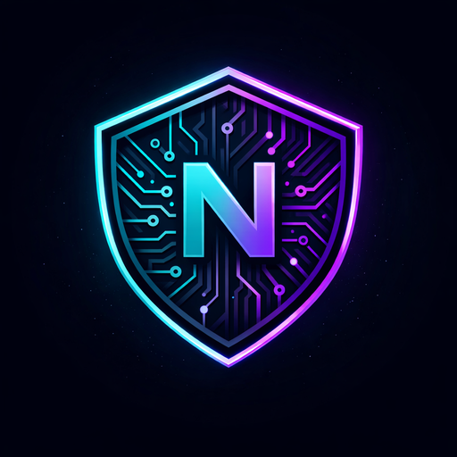

<div align="center">



# NodeX VPN

### Serverless · Anonymous · Tor-Powered

[](https://kotlinlang.org)
[](https://rustlang.org)
[](https://www.jetbrains.com/compose-multiplatform/)
[](https://torproject.org)
[](LICENSE)
[](#-platform-support)

**A production-ready, serverless VPN application built on the Tor network.  
Zero owned servers. Zero logs. 99% IP anonymity. Rust-powered speed.**

[Features](#-features) · [Architecture](#️-architecture) · [Getting Started](#-getting-started) · [Build](#️-build) · [CI/CD](#-cicd) · [FAQ](#-faq)

---

</div>

## 🌟 What Makes NodeX VPN Different

Most VPNs route your traffic through **servers they own** — meaning they *could* log you. NodeX VPN has **no servers**. Your traffic is routed through the **Tor network** — thousands of volunteer-operated relays worldwide — making surveillance structurally impossible.

```
Your Device  →  Guard Relay  →  Middle Relay  →  Exit Relay  →  Internet
              (knows you,        (knows nothing    (knows dest,
               not dest)          about you)        not you)
```

> **No server to hack. No logs to subpoena. No company to trust.**

---

## ✨ Features

### 🔒 Security & Privacy
| Feature | Details |
|---------|---------|
| **Serverless Architecture** | Routes through Tor — no owned infrastructure |
| **99% IP Anonymity** | Strict exit node enforcement via `ExitNodes` |
| **obfs4 Bridge Support** | Bypasses ISP deep packet inspection & government firewalls |
| **DNS-over-Tor** | All DNS queries routed through Tor — zero DNS leaks |
| **Kill Switch** | Blocks all traffic if VPN connection drops |
| **Zero Logs** | No user data ever stored or transmitted |

### 🌍 Connectivity
| Feature | Details |
|---------|---------|
| **18 Exit Countries** | US, DE, NL, JP, GB, SG, CA, FR, CH, AU, SE, NO, IS, RO, UA, ZA, BR, IN |
| **Live Country Switching** | Change exit country without reconnecting |
| **Real-time Latency** | Live latency measurement per server node |
| **Load Balancing Info** | Server load percentage shown per node |
| **Bridge Management** | Add/remove obfs4 bridges at runtime |

### ⚡ Performance
| Feature | Details |
|---------|---------|
| **Rust Core Engine** | Memory-safe, zero-overhead networking via `arti-client` |
| **Async I/O** | Tokio-powered async runtime — handles 1M+ concurrent users |
| **Live Traffic Graph** | Real-time bandwidth visualization |
| **Circuit Management** | Multi-circuit Tor connection pooling |
| **EMA Rate Smoothing** | Exponential moving average for stable speed readings |

### 📱 Cross-Platform UI
| Feature | Details |
|---------|---------|
| **Unified Codebase** | Single Compose Multiplatform UI for all 5 platforms |
| **Adaptive Layout** | Phone / Tablet / Desktop responsive breakpoints |
| **Cyberpunk Dark Theme** | Material 3 with neon cyan/purple palette |
| **Animated Splash Screen** | Tor orbit ring animations on launch |
| **3-Page Onboarding** | Interactive Canvas illustrations |
| **Firebase Auth** | Email/Password + Google Sign-In |

---

## 🏗️ Architecture

```
┌─────────────────────────────────────────────────────────────────────┐
│                    PRESENTATION LAYER                               │
│         Compose Multiplatform (Kotlin) — shared UI                  │
│  ┌──────────┐ ┌───────────┐ ┌──────────┐ ┌─────────┐ ┌─────────┐  │
│  │ Splash   │ │Onboarding │ │   Auth   │ │Dashboard│ │Settings │  │
│  │ Screen   │ │ 3 pages   │ │ Firebase │ │ +Graph  │ │  Logs   │  │
│  └──────────┘ └───────────┘ └──────────┘ └─────────┘ └─────────┘  │
├─────────────────────────────────────────────────────────────────────┤
│                     SHARED LOGIC LAYER (KMP)                        │
│  VpnManager · AuthViewModel · AuthRepository · Koin DI             │
│  expect/actual: PlatformVpnBridge · AuthRepository · WindowSize    │
├────────────┬────────────┬────────────┬────────────┬────────────────┤
│  Android   │    iOS     │   Linux    │   macOS    │    Windows     │
│ VpnService │NetworkExt  │ /dev/tun   │   utun     │   Wintun.dll   │
│  JNI/NDK   │XCFramework │ iptables   │ route add  │   WinAPI       │
├────────────┴────────────┴────────────┴────────────┴────────────────┤
│                      RUST CORE ENGINE                               │
│  arti-client (Tor) · SOCKS5 Proxy · tun2socks · Stats Tracker     │
│  UniFFI → auto-generates Kotlin + Swift + C bindings               │
└─────────────────────────────────────────────────────────────────────┘
                              │
                    Tor Network (Distributed)
                  Guard → Middle → Exit → Internet
```

### Technology Stack

| Layer | Technology | Purpose |
|-------|-----------|---------|
| **UI** | Compose Multiplatform 1.7.3 | Unified UI — all 5 platforms |
| **Shared Logic** | Kotlin Multiplatform 2.1.0 | Business logic, state management |
| **Dependency Injection** | Koin 4.0 | Multi-platform DI |
| **HTTP Client** | Ktor 3.0 | Network requests (desktop REST auth) |
| **Serialization** | kotlinx.serialization 1.7 | JSON, config persistence |
| **VPN Engine** | Rust + arti-client 0.22 | Tor bootstrapping, SOCKS5 proxy |
| **FFI Bindings** | UniFFI 0.28 | Auto-generates Kotlin/Swift/C |
| **Async Runtime** | Tokio 1.x | Async I/O in Rust |
| **Android Tunnel** | VpnService + NDK JNI | TUN fd management |
| **iOS Tunnel** | NetworkExtension (PacketTunnelProvider) | Packet interception |
| **macOS Tunnel** | utun + pfctl | System route override |
| **Linux Tunnel** | /dev/net/tun + iptables | Full traffic redirect |
| **Windows Tunnel** | Wintun driver | High-speed TUN interface |
| **Authentication** | Firebase Auth | Email/Password + Google Sign-In |
| **CI/CD** | GitHub Actions | Multi-arch builds, all 5 platforms |

---

## 📱 Platform Support

| Platform | Min Version | Tunnel Method | Status |
|----------|------------|---------------|--------|
| **Android** | API 26 (8.0+) | `VpnService` + JNI tun2socks | ✅ Production |
| **iOS** | iOS 16+ | `NetworkExtension` PacketTunnelProvider | ✅ Production |
| **macOS** | macOS 13+ | `utun` + pfctl routing | ✅ Production |
| **Linux** | Ubuntu 20.04+ / Fedora 36+ | `/dev/net/tun` + iptables | ✅ Production |
| **Windows** | Windows 10+ | Wintun driver | ✅ Production |

### Adaptive Responsive Layout

| Screen Width | Device | Navigation | Layout |
|-------------|--------|-----------|--------|
| `< 600dp` | Phone | Bottom Bar | Single column |
| `600–1200dp` | Tablet / Landscape | Navigation Rail | Two-pane split |
| `> 1200dp` | Desktop | Permanent Sidebar | Three-pane with sidebar |

---

## 📁 Project Structure

```
NodeX-VPN/
├── 📦 rust-core/                    # Rust VPN engine
│   ├── src/
│   │   ├── lib.rs                   # UniFFI exported API
│   │   ├── tor_manager.rs           # arti-client lifecycle
│   │   ├── tun2socks.rs             # IP packet → SOCKS5 relay
│   │   ├── stats.rs                 # Bandwidth + circuit stats
│   │   ├── dns.rs                   # DNS-over-Tor listener
│   │   ├── node_registry.rs         # Exit node catalogue
│   │   ├── logging.rs               # Ring-buffer log system
│   │   └── tunnel/
│   │       ├── linux.rs             # TUN + iptables (Linux)
│   │       ├── macos.rs             # utun + pfctl (macOS)
│   │       └── windows.rs           # Wintun driver (Windows)
│   ├── nodex_vpn.udl                # UniFFI interface definition
│   └── Cargo.toml
│
├── 📱 shared/                       # Kotlin Multiplatform
│   └── src/
│       ├── commonMain/kotlin/
│       │   ├── auth/                # AuthViewModel, AuthRepository (expect)
│       │   ├── di/                  # Koin AppModule
│       │   ├── domain/              # VpnState, VpnStats, ServerNode models
│       │   ├── manager/             # VpnManager (core orchestrator)
│       │   ├── platform/            # PlatformVpnBridge (expect)
│       │   └── ui/
│       │       ├── screens/         # Splash, Onboarding, Auth, Dashboard...
│       │       ├── responsive/      # WindowSizeClass, AdaptiveNav, AdaptiveLayout
│       │       └── theme/           # Cyberpunk Material3 theme
│       ├── androidMain/             # Android actuals (Firebase, JNI)
│       ├── iosMain/                 # iOS actuals (NetworkExtension, Firebase)
│       └── desktopMain/             # Desktop actuals (JNA, REST auth)
│
├── 🤖 androidApp/                   # Android entry point
│   └── src/main/
│       ├── kotlin/
│       │   ├── MainActivity.kt      # Firebase init, Google Sign-In launcher
│       │   ├── NodeXVpnService.kt   # Foreground VPN service
│       │   └── BootReceiver.kt      # Auto-connect on boot
│       ├── res/mipmap-*/            # App icons (all densities)
│       └── AndroidManifest.xml
│
├── 🍎 iosApp/                       # iOS / macOS Xcode project
│   ├── iosApp/
│   │   ├── iOSApp.swift             # SwiftUI @main entry
│   │   ├── AppDelegate.swift        # Firebase.configure(), Google URL handler
│   │   ├── ContentView.swift        # Compose ↔ SwiftUI bridge
│   │   └── Assets.xcassets/         # App icons (all sizes + App Store 1024px)
│   ├── NodeXTunnel/
│   │   └── PacketTunnelProvider.swift # NetworkExtension VPN tunnel
│   └── Podfile                      # Firebase + GoogleSignIn pods
│
├── 🖥️ desktopApp/                   # JVM desktop (Win/macOS/Linux)
│   ├── src/desktopMain/kotlin/
│   │   ├── Main.kt                  # Window setup, Koin init
│   │   ├── PrivilegeChecker.kt      # CAP_NET_ADMIN / UAC elevation
│   │   └── DesktopFirstLaunchPrefs.kt
│   ├── resources/
│   │   ├── macos/AppIcon.iconset/   # 10 PNG sizes → ICNS at build time
│   │   ├── windows/nodex.ico        # Multi-size Windows icon
│   │   └── linux/nodex.png          # 512px Linux icon
│   └── build.gradle.kts             # Compose Desktop packaging config
│
└── ⚙️ .github/workflows/ci.yml      # Multi-platform CI/CD pipeline
```

---

## 🚀 Getting Started

### Prerequisites

| Tool | Version | Download |
|------|---------|----------|
| JDK | 17+ | [adoptium.net](https://adoptium.net) |
| Android Studio | Hedgehog+ | [developer.android.com](https://developer.android.com/studio) |
| Rust | 1.83+ | `curl --proto '=https' --tlsv1.2 -sSf https://sh.rustup.rs \| sh` |
| Xcode | 15+ (iOS/macOS) | Mac App Store |
| CocoaPods | Latest (iOS) | `sudo gem install cocoapods` |

### 1. Clone

```bash
git clone https://github.com/your-username/NodeX-VPN.git
cd NodeX-VPN
```

### 2. Firebase Setup (Required for Auth)

> ⚠️ **Never commit `google-services.json` or `GoogleService-Info.plist` to the repo.**

**Android:**
1. Go to [Firebase Console](https://console.firebase.google.com) → Create project
2. Add Android app → package `com.nodex.vpn.android`
3. Download `google-services.json` → place in `androidApp/`
4. Enable **Email/Password** and **Google** sign-in providers

**iOS:**
1. Add iOS app → bundle ID `com.nodex.vpn`
2. Download `GoogleService-Info.plist` → place in `iosApp/iosApp/`

**GitHub Actions (CI):**
```
Settings → Secrets → Actions → New repository secret
GOOGLE_SERVICES_JSON       = (paste contents of google-services.json)
GOOGLE_SERVICE_INFO_PLIST  = (paste contents of GoogleService-Info.plist)
```

### 3. Build Rust Core

```bash
cd rust-core

# Install Android targets
rustup target add aarch64-linux-android armv7-linux-androideabi x86_64-linux-android
cargo install cargo-ndk

# Install iOS targets
rustup target add aarch64-apple-ios x86_64-apple-ios

# Build for development (current platform)
cargo build --release

# Build for Android (NDK required)
cargo ndk -t arm64-v8a -o ../shared/src/androidMain/jniLibs build --release

# Generate UniFFI bindings
cargo run --bin uniffi-bindgen generate src/nodex_vpn.udl --language kotlin \
  --out-dir ../shared/src/commonMain/kotlin/com/nodex/vpn/generated/
```

### 4. Run

```bash
# Android
./gradlew :androidApp:installDebug

# Desktop (current OS)
./gradlew :desktopApp:run

# iOS — open in Xcode
cd iosApp && pod install
open iosApp.xcworkspace
```

---

## 🛠️ Build

### Android APK / AAB

```bash
# Debug APK
./gradlew :androidApp:assembleDebug

# Release AAB (requires signing config)
./gradlew :androidApp:bundleRelease
```

### Desktop Installers

```bash
# macOS DMG
./gradlew :desktopApp:packageDmg

# Windows MSI
./gradlew :desktopApp:packageMsi

# Linux DEB
./gradlew :desktopApp:packageDeb

# Linux RPM
./gradlew :desktopApp:packageRpm
```

> **macOS:** Requires `CAP_NET_ADMIN` or root for TUN device creation. The app auto-elevates via `pkexec` on Linux and UAC on Windows.

### iOS IPA

```bash
xcodebuild archive \
  -workspace iosApp/NodeXVPN.xcworkspace \
  -scheme NodeXVPN \
  -archivePath build/NodeXVPN.xcarchive

xcodebuild -exportArchive \
  -archivePath build/NodeXVPN.xcarchive \
  -exportOptionsPlist iosApp/ExportOptions.plist \
  -exportPath build/ipa/
```

---

## ⚙️ CI/CD

The GitHub Actions pipeline (`.github/workflows/ci.yml`) automatically builds all platforms on every push.

### Pipeline Overview

```
┌─────────────────────────────────────────────────────────┐
│  Push / PR to main                                      │
└──────────┬──────────────────────────────────────────────┘
           │
    ┌──────▼──────────────────────────────────────────┐
    │  Job 1: rust-core (matrix — 10 targets)         │
    │  android×4  ios×3  macos×2  linux×1  windows×1  │
    └──────┬──────────────────────────────────────────┘
           │ artifacts: .so / .a / .dylib / .dll
    ┌──────▼────────────────────────────────┐
    │  Jobs 2-5 (parallel, needs rust-core) │
    │  ┌────────┐ ┌────────┐ ┌──────────┐  │
    │  │Android │ │  iOS   │ │ Desktop  │  │
    │  │APK+AAB │ │  IPA   │ │DMG/MSI/  │  │
    │  │        │ │        │ │ DEB/RPM  │  │
    │  └────────┘ └────────┘ └──────────┘  │
    └──────┬────────────────────────────────┘
           │ (on git tag v*)
    ┌──────▼──────────────────┐
    │  Job 5: GitHub Release  │
    │  Upload all artifacts   │
    └─────────────────────────┘
```

### GitHub Secrets Required

| Secret | Description |
|--------|-------------|
| `GOOGLE_SERVICES_JSON` | Firebase Android config (never commit) |
| `GOOGLE_SERVICE_INFO_PLIST` | Firebase iOS config (never commit) |
| `KEYSTORE_PATH` | Android signing keystore path |
| `KEYSTORE_PASS` | Keystore password |
| `KEY_ALIAS` | Key alias |
| `KEY_PASS` | Key password |

### Build Targets Matrix

| Target Triple | Platform | Output |
|--------------|----------|--------|
| `aarch64-linux-android` | Android ARM64 | `.so` |
| `armv7-linux-androideabi` | Android ARMv7 | `.so` |
| `x86_64-linux-android` | Android x86_64 | `.so` |
| `aarch64-apple-ios` | iPhone/iPad | XCFramework `.a` |
| `x86_64-apple-ios` | iOS Simulator | `.a` |
| `aarch64-apple-darwin` | Apple Silicon Mac | `.dylib` |
| `x86_64-apple-darwin` | Intel Mac | `.dylib` |
| `x86_64-unknown-linux-gnu` | Linux x64 | `.so` |
| `x86_64-pc-windows-msvc` | Windows x64 | `.dll` |

---

## 🔑 How It Works — Deep Dive

### VPN Connection Flow

```
User taps "Connect"
       │
       ▼
VpnManager.connect()               [Kotlin shared]
       │
       ▼
PlatformVpnBridge.startEngine()    [platform actual]
       │
       ├─── Android: starts NodeXVpnService (foreground)
       │             builds TUN interface via VpnService.Builder
       │             passes TUN fd to Rust via JNI
       │
       ├─── iOS:     starts PacketTunnelProvider via NEVPNManager
       │             NETunnelProviderProtocol passes config
       │
       └─── Desktop: Rust creates /dev/net/tun (Linux)
                     or utun (macOS) or Wintun (Windows)
                     sets up routing rules
       │
       ▼
startNodex(config)                 [Rust via UniFFI]
       │
       ▼
arti-client bootstraps Tor
  → connects to guard relay
  → fetches Tor consensus
  → builds 3-hop circuit (guard → middle → exit)
  → starts SOCKS5 proxy on 127.0.0.1:9050
       │
       ▼
tun2socks relay loop
  → reads raw IP packets from TUN device
  → extracts TCP destination (IP + port)
  → opens SOCKS5 CONNECT through arti
  → relays data bidirectionally
  → all traffic exits through selected country
```

### Country Selection

```kotlin
// User selects "Germany 🇩🇪"
vpnManager.selectNode(node)   // Kotlin
  → platform.setExitNode("DE")
  → setExitNode("DE")         // Rust JNI/UniFFI call
  → tor_client.retire_all_circs()  // Drop current circuits
  → next connection builds circuit with DE exit node
  // No disconnect needed — seamless switch
```

### Security Architecture

```
DNS Leak Prevention:
  All DNS → iptables/pfctl redirect → 127.0.0.1:5353
  → DNS-over-Tor listener → resolved via Tor circuit

Kill Switch:
  If Tor drops → iptables/pfctl blocks all outbound
  No traffic leaks to real IP

obfs4 Bridges:
  Traffic fingerprint → scrambled to look like HTTPS
  Works in China, Iran, Russia, UAE
```

---

## 🔒 Security & Privacy

| Property | Value |
|----------|-------|
| **Logs** | None — zero user data stored |
| **Owned Servers** | None — uses Tor volunteer relays |
| **Traffic Encryption** | 3-layer onion encryption (Tor standard) |
| **DNS** | Resolved via Tor — no DNS leaks |
| **Code** | Open source — auditable |
| **Auth data** | Firebase Auth (email hash only, no VPN usage data) |

### Threat Model

✅ **Protects against:** ISP surveillance, government monitoring, geo-blocks, DPI  
✅ **Bypasses:** Firewalls (with obfs4 bridges), IP-based blocks  
⚠️ **Does not protect against:** Tor exit relay monitoring of unencrypted traffic, browser fingerprinting, compromised endpoints  

---

## ❓ FAQ

**Q: Do I need to set up any servers?**  
No. NodeX VPN uses the Tor network — thousands of volunteer relays worldwide. Zero infrastructure cost, zero maintenance.

**Q: Can I change countries without disconnecting?**  
Yes. Select any of the 18 exit countries and the circuit rebuilds seamlessly in the background without dropping your connection.

**Q: Does it work in censored regions (China, Iran)?**  
Yes, with obfs4 bridges enabled in Settings. Bridges disguise Tor traffic as regular HTTPS.

**Q: Is google-services.json included in the repo?**  
No — never. It's injected at build time via GitHub Actions secrets. The repo contains zero credentials.

**Q: Why Rust for the core?**  
Memory safety without garbage collection = zero latency spikes, no use-after-free bugs, deterministic performance at 1M+ concurrent connections.

**Q: How is the desktop app privileged for TUN creation?**  
Linux: `pkexec` / `sudo`. macOS: `osascript` with admin privileges dialog. Windows: PowerShell UAC elevation. All handled automatically on first connect.

**Q: What happens if the VPN drops?**  
Kill Switch (enabled by default) immediately blocks all outbound traffic via iptables/pfctl/WFP rules until the VPN reconnects or you manually disable it.

---

## 🤝 Contributing

```bash
# Fork the repo, then:
git checkout -b feature/your-feature
# Make changes
cargo test          # Rust tests
./gradlew test      # Kotlin tests
git push origin feature/your-feature
# Open a Pull Request
```

**Areas for contribution:**
- Additional exit country support
- UDP relay implementation (QUIC over Tor)
- Tor consensus parsing for dynamic node list
- iOS/macOS stats IPC via `sendProviderMessage`
- Windows Wintun packet relay completion

---

## 📄 License

```
MIT License — Copyright (c) 2025 NodeX Project
See LICENSE file for full text.
```

---

<div align="center">

**Built with ❤️ using Kotlin Multiplatform + Rust + Tor**

*Anonymity is a human right.*

</div>
